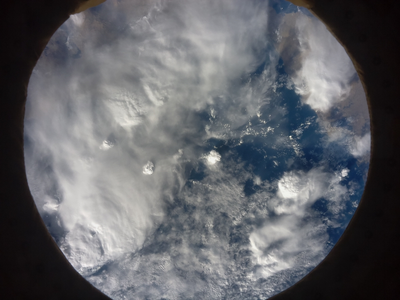

# Computing the albedo from images of the Earth taken from the ISS
## Table of contents
* [Technicalities](#technicalities)
* [Purpose of this project](#purpose-of-this-project)
* [Algorithm and meaning](#algorithm-and-meaning)

## Technicalities
The code is intended for the RaspberryPi 3B+ and was tested on Python 3.5 (that's what we had to use for the Astro Pi contest), but should also work on other versions of Python 3 :snake:

The images photographed from the ISS are like this:

and many other examples here:

https://projects.raspberrypi.org/en/projects/code-for-your-astro-pi-mission-space-lab-experiment/1

For those images, we need to ignore the lens margins, so we made some helper images to subtract that pixels from the original photos, and then make the computations.
## Purpose of this project
We intend to calculate the albedo values of the photographed surfaces of Earth from the ISS. By gathering this information, we are able to discover the theoretical temperature in that
area and make assumptions about greenhouse effect and aerosols, thus reaching a conclusion on the climate state of our planet. :earth_africa:
## Algorithm and meaning
During daytime on the ISS, the pi will take photos. During night time, it will make computations.
For a given photo, the program will compute first the light directions, then the normal and albedo maps. The albedo will be calculated both from the original image and the albedo map
of the image, by the blank-paper-sheet-of-albedo-0.65 relative rule -> http://albedodreams.info/how_to/how-to-calculate-albedo-yourself/ .

After computing the albedo, using the Stefan-Boltzmann law, we compute the temperature of the photographed surface. This doesn't take into account the greenhouse effect, so the 
temperatures are in fact lower than the ones recorded on Earth. The difference will give us answers regarding the greenhouse effect and climate change.

